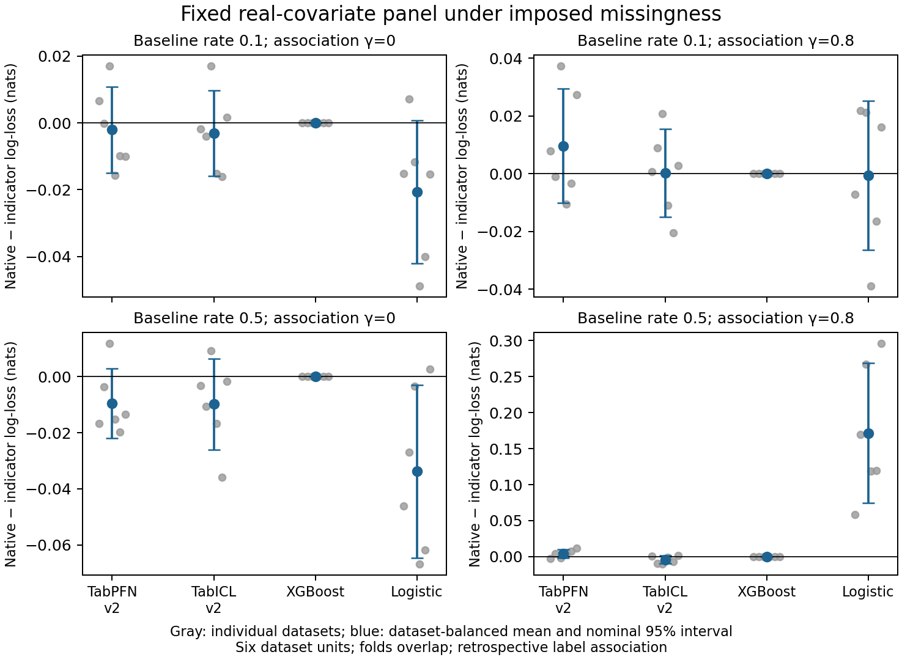

# MIRA

Controlled experiments on missingness representation in frozen tabular predictors.

**Status:** research evidence through Day 8 completed for accessible checkpoints: 1,296 development cells, 360 frozen confirmation cells, 240 CPU baseline predictions and 1,440 frozen real-covariate cells. The confirmed synthetic effect is scoped; dataset-balanced TFM gains on the six-dataset panel are small and uncertain. Adapter training remains inactive.

Start with [STATUS.md](STATUS.md), [SPRINT.md](SPRINT.md) and [decision.md](decision.md). The manuscript is `paper/main.tex`, edited in Codex's built-in LaTeX panel; compilation currently has an environment error. The original repository was empty when cloned on October 1, 2026; this checkout is the implementation workspace.

## Local verification

Use a fresh Python 3.12 environment and install this package with its test extras. Exact successful GPU environments are written with each run rather than pretending that a bootstrap is a complete lock.

```powershell
python -m pip install -e ".[test]"
python -m pytest tests -q
python scripts/run_mechanism.py --help
```

## Bounded Modal smoke

The Modal CLI uses existing local credentials. Keep credentials outside Git. From this directory, with an environment containing `modal==1.6.0`:

```powershell
$env:PYTHONUTF8='1'
python -m modal run infra/modal_mechanism.py --run-id smoke_tabpfn_v2 --model tabpfn:v2
```

Every run needs a unique ID. Smoke calls use the preserved pilot, reserve $0.50 of the $26 cap (initial historical smoke reservations were $0.35), use one T4 and expire after 900 seconds. See `configs/budget.json`. Results are extracted to `artifacts/runs/<run_id>`; logs, failed calls and cost estimates remain in the ledger. GPU prediction files and checkpoints are ignored by Git; publish only a curated anonymous reproduction bundle after final review.

The supplied task notes are proposed specifications and evidence. Current user instructions govern authorization and the deadline. This project reports uncertainty and limitations; readiness depends on executed experiments.

Development reports: `artifacts/reports/development_gaussian/`, `artifacts/reports/development_collision/`, and `artifacts/reports/preprocessing_audit.md`. Plot regeneration: `python scripts/plot_development.py` (requires matplotlib). Raw GPU predictions remain local under ignored `artifacts/runs/`; their hashes, exact configs and source identities are preserved with each run. Package them for final artifact review once the scientific protocol is frozen.

Day 1–3 checkpoint: [development summary](artifacts/reports/day3_summary.md), [data audit](artifacts/reports/day3_data_audit.md), [readiness audit](artifacts/reports/day3_readiness.md). Local dispatch requirements and named catalog usage: [infra/README.md](infra/README.md). Regenerate the summary with `python scripts/summarize_day3.py` after verifying the individual saved-run reports.

## Confirmed scoped result

A protocol committed before evaluation completed 360 confirmation cells. On 20 fresh Gaussian pairwise-mask tasks, TabPFN v2's indicator gain is **0.10389 nats** [0.07969,0.12809]; actual versus same-width shuffled gain is **0.09499** [0.06162,0.12837]. These 97.5% paired intervals cover the two prespecified primary contrasts with Bonferroni nominal familywise coverage of 95%. Scope: 256 labels, named checkpoint, specified synthetic generator. No real-data or adapter claim.


[Protocol](configs/confirmation_pairwise_v1.json), [decision and audit](artifacts/reports/confirmation_pairwise_v1/decision.md), [full report](artifacts/reports/confirmation_pairwise_v1/report.md). Regenerate reports with confidence .975, then run `python scripts/analyze_confirmation.py`; raw predictions must be present locally.

## Day 4–8 evidence

[Completion record](artifacts/reports/day4_8_completion.md), [independent audit](artifacts/reports/day4_8_readiness.md), [strong operational baselines](artifacts/reports/strong_baselines/report.md), and [full real-covariate panel](artifacts/reports/real_panel_v1/report.md).

The support-trained L1 mask-interaction baseline nearly closes the synthetic oracle gap. The frozen six-dataset panel includes all 1,440 cells and negative/control outcomes. It imposes retrospective missingness on real covariates; six datasets are uncertainty units. Native-input TFM improvements remain uncertain, while imputed logistic gains at high imposed association and loses at zero association.



```powershell
python scripts/report_real_panel.py
python scripts/plot_real_panel.py
python scripts/run_strong_baselines.py --help
```

Report regeneration requires saved raw runs. Canonical public CC BY 4.0 data/splits are tracked with source citations and hashes. Paid panel reproduction uses `infra/modal_real_panel.py::panel`, the frozen `configs/real_panel_v1.json` and a new run ID; all calls reserve cost before execution. Raw GPU predictions stay local pending final anonymous packaging. Reservations are $9.05, provider-reported app charges $0.50322492 may lag, and $3 remains reserved for reproduction within the $26 cap. The same manuscript was updated; native compilation still has an environment error, so PDF layout remains unverified.

## Reversible-mask extension

[Plan](docs/MASK_COMPILER_PLAN.md), [CPU development evidence](artifacts/reports/mask_compiler_v0/interpretation.md), [three-agent review](artifacts/reports/mask_compiler_v0/audit.md).80 tasks / 480 CPU predictions completed with no paid calls; same-width invertible coordinates can simplify a restricted logistic problem, with mixed sparse-baseline comparisons and zero-signal harms. TFM benefit/novelty are unestablished. Draft `configs/mask_compiler_gate_v1.json` limits initial paid feasibility to$1 after a runnable protocol freeze; fresh confirmation and external validation remain pending.
