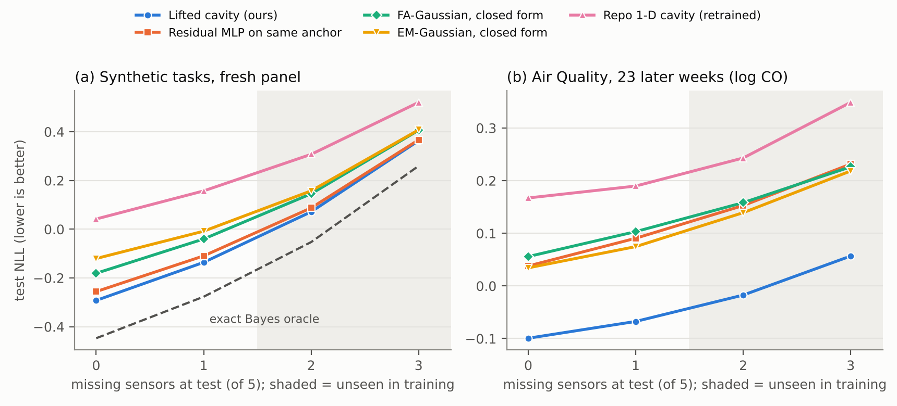

# Lifted cavity network: oracle audit, repair and first positive result (October 6, 2026)

**Summary.** The cavity line failed its gates because of how it was tested and parameterised, not because the
problem lacked headroom. On the repository's own `anchored_cavity_v1` panel the exact Bayes posterior scores
**−0.046** NLL; the ridge control scores 0.396 and the best repaired cavity seed 0.403. A support-only closed form
(EM joint Gaussian + one-factor analysis) already scores 0.156 without training. The new **lifted cavity network**
puts every sensor site on a target-plus-nuisance latent `(y, h)`, starts exactly at that closed form, and learns
cavity-conditioned re-linearisations. Trained only on masks with at most one missing sensor, it scores **0.077** on
that same panel. It also improves on the strongest closed forms on fresh tasks with unseen masks, on 8-sensor tasks
after training on 5, and on 23 future weeks of a real multi-sensor air-quality dataset.

Sections 1–3 are development work from October 6; their panels are now used data. A separate confirmation
protocol was committed before its panels existed (`LIFTED_CAVITY_CONFIRMATION.md`), and all five of its endpoints
pass. The endpoints cover fresh synthetic tasks, 8-sensor transfer, stronger nonlinearity and a new real target
(NO2). Next steps are in `OCT10_PLAN.md`.

## 1. Why the cavity gates failed

`experiments/lifted_cavity/oracle_audit.py` replays `cavity_site.generate` exactly (maximum replay error 2.3e-7) to
recover every task's parameters. It then computes, for each task, mask and query, the exact posterior of `y` by
1-D quadrature, checked against importance sampling in `tests/test_lifted_cavity.py`.

Three things went wrong:

1. **The ridge control was weak.** It mean-imputes the 20%-missing support, which attenuates coefficients and
   inflates its leave-one-out variance (coverage .98). Restricting ridge to complete-case rows gains 0.20 nats. A
   support-only EM joint Gaussian, or its one-factor structured version, gains 0.23–0.24.
2. **1-D sites cannot express shared-noise fusion consistently across masks.**
   - With a common noise source `u`, the Bayes weight on a sensor can be positive when it is alone and negative
     once a second sensor allows the common noise to be differenced out. The unit test reproduces this sign flip.
   - A product of positive-precision 1-D sites keeps each sensor's sign, so mask-independent 1-D sites cannot be
     Bayes-consistent across masks (Proposition 1 below).
   - The repo's cavity passes only a 1-D summary of the other sensors (cavity mean and precision of `y`), which
     discards the information needed to estimate `u`.
3. **The amortised learners were starved.**
   - They had 512 reused source tasks, 3,000 updates and ~3k-parameter networks.
   - Their inputs were pairwise-complete moments, which are mutually inconsistent under missingness: one-factor
     analysis computed from them scores 0.94 NLL, versus 0.12 from EM.
   - Retraining the repo architectures on 60,000 tasks for 20,000 steps improves them by only ~0.05 nats. They stay
     ~0.18 nats behind the untrained closed form (Table B).

## 2. The lifted cavity network

**Latent and sites.**
- The latent is `z = (y, h)`, with `h ∈ R^K` a nuisance shared across sensors.
- Each observed sensor `j` contributes one rank-1 Gaussian site over `z`: precision `w_j w_jᵀ/ψ_j` and natural mean
  `w_j o_j/ψ_j`.
- The prediction is the `y`-marginal of prior × product of the observed sites.
- Missing sensors contribute no site, so every one of the `2^P` masks is handled by omission. No sensor identity
  enters, so the same weights run on any number of sensors.

**Round 0 (no learning).**
- Sites come from a support-only supervised factor analysis: an EM joint Gaussian of `(x, y)` over the incomplete
  support, `A = Cov(x,y)/Var(y)`, then principal factors of the residual covariance for `(D, ψ)`.
- This product is exactly the conditional Gaussian of `y` under the structured covariance, for every mask.
- The network's output layer is zero-initialised, so the untrained model is this closed form (tested to 1e-4).

**Refinement rounds (3).** For each observed sensor:
- Remove its site to form the cavity `q_{-j}(y, h)`.
- A shared 64-unit network maps the following to a replacement site:
  - the sensor value;
  - a DeepSets encoding of that sensor's own support scatter `{(y_i, x_ij)}`;
  - its anchor loadings;
  - the cavity mean and covariance;
  - the cavity's predicted value of the sensor and its standardised residual.
- The replacement site is a local re-linearisation at the cavity mean (offset and slope), a nuisance-loading
  correction and a bounded noise scale. This is learned EP, with the cavity defining where to linearise.
- About 8k parameters.

**Proposition 1 (1-D products are not mask-consistent under shared noise).**
- Setting: `x_j = a_j y + d_j u + σ_j ε_j`, with all variables standard normal.
- Claim: no product of mask-independent 1-D Gaussian sites `t_j(y; x_j)` with positive precision reproduces the Bayes
  posterior on every singleton and every pair.
- Why:
  - Matching each singleton's posterior forces constant site precisions and linear site means.
  - The pair's posterior-mean coefficients are then positive multiples of the singleton coefficients.
  - Shared noise can flip the sign of a Bayes pair coefficient; the test example gives ≈ −0.96 against a positive
    singleton.

**Proposition 2 (lifting is exact).** If `x_j = w_jᵀ z + c_j + e_j` with independent `e_j`, the product of the
`|S|` rank-1 sites over `z` equals `p(z | x_S)` for every `S`. This is conditional independence given `z`. Both
statements are elementary; their value is in explaining the failures and the design.

## 3. Results

**Setup.** All learned models used the same 60,000-task pool (seed 5150), the same minibatches (128 tasks × 8
queries) and the same masks: the repo's source regime, at most one missing sensor. They also shared AdamW (lr
1.8e-3, cosine to 10%, weight decay 1e-4), 20,000 updates, gradient clipping at 5, and CPU with one thread. No
hyperparameter search was run for any model. All closed forms use the n/(n−|S|−1) variance correction.

**Table A. Repository development panels, all ten two-sensor deletions (mean Gaussian NLL, lower is better).**
Rows marked privileged use the true task parameters; every other row sees only the 48 labeled support rows.

| Method | `cavity_site_v1` panel | `anchored_cavity_v1` panel |
|---|---:|---:|
| Exact Bayes oracle (privileged) | 0.014 | -0.046 |
| Population joint Gaussian (privileged) | 0.114 | 0.057 |
| Lifted cavity K=1, seed 1 (this work) | 0.150 | 0.077 |
| Residual MLP on same anchor, seed 1 | 0.160 | 0.086 |
| FA-Gaussian, support-only | 0.216 | 0.156 |
| EM-Gaussian, support-only | 0.233 | 0.168 |
| Complete-case ridge | 0.258 | 0.195 |
| Repo ridge (the gate's control) | 0.429 | 0.396 |
| Repo cavity (3 seeds) | 1.429 (all seeds collapsed) | 0.403–0.430 |
| Repo full aggregate (3 seeds) | 1.429 (all seeds collapsed) | 0.408–0.413 |
| Repo static sites (3 seeds) | 1.429 (all seeds collapsed) | 0.412–0.441 |
| Repo larger MLP (3 seeds) | 0.727–0.883 | 0.436–0.513 |

**Table B. Fresh panel (256 new tasks, seed 20261007). Mean NLL by number of missing query sensors. Learned models were trained only on masks with at most one missing sensor, so k = 2 and 3 are unseen patterns. Learned rows: mean ± s.d. over training seeds (n in brackets). Last column: share of the FA-Gaussian→oracle gap closed at k = 2.**

| Method | k=0 | k=1 | k=2 | k=3 | gap closed (k=2) |
|---|---:|---:|---:|---:|---:|
| Exact Bayes oracle (privileged) | -0.468 | -0.295 | -0.068 | 0.250 | 1.00 |
| Moment-matched Gaussian oracle (privileged) | -0.464 | -0.289 | -0.058 | 0.266 | 0.95 |
| Population joint Gaussian (privileged) | -0.331 | -0.166 | 0.045 | 0.334 | 0.43 |
| **Lifted cavity, K=1** [3] | -0.308 ± 0.001 | -0.152 ± 0.001 | 0.059 ± 0.001 | 0.358 ± 0.000 | 0.37 |
| Lifted cavity, K=2 [1] | -0.306 | -0.149 | 0.062 | 0.362 | 0.35 |
| Residual MLP on the same anchor + encoders [3] | -0.273 ± 0.000 | -0.123 ± 0.000 | 0.078 ± 0.000 | 0.362 ± 0.000 | 0.27 |
| Lifted sites, no cavity input [3] | -0.265 ± 0.001 | -0.115 ± 0.001 | 0.084 ± 0.001 | 0.363 ± 0.001 | 0.24 |
| FA-Gaussian, support-only (closed form) | -0.202 | -0.058 | 0.132 | 0.398 | 0.00 |
| EM-Gaussian, support-only (closed form) | -0.121 | -0.025 | 0.142 | 0.399 | -0.05 |
| Complete-case ridge (closed form) | -0.061 | 0.023 | 0.170 | 0.409 | -0.19 |
| 1-D sites, same machinery (K=0) [3] | -0.094 ± 0.001 | 0.034 ± 0.001 | 0.205 ± 0.002 | 0.445 ± 0.002 | -0.36 |
| Repo anchored aggregate, 60k tasks/20k steps [1] | 0.043 | 0.157 | 0.305 | 0.511 | -0.87 |
| Repo MLP, 60k tasks/20k steps [1] | 0.030 | 0.150 | 0.307 | 0.523 | -0.88 |
| Repo anchored cavity, 60k tasks/20k steps [1] | 0.044 | 0.159 | 0.310 | 0.522 | -0.89 |
| Repo anchored cavity, 60k tasks/3k steps [1] | 0.081 | 0.192 | 0.334 | 0.528 | -1.01 |
| Repo anchored cavity, repo regime (512 tasks/3k steps) [1] | 0.107 | 0.216 | 0.355 | 0.547 | -1.12 |
| Repo MLP, repo regime [1] | 0.099 | 0.219 | 0.374 | 0.588 | -1.21 |
| Repo ridge, mean-imputed (closed form) | 0.201 | 0.277 | 0.390 | 0.566 | -1.29 |

Paired task-level 95% intervals for the seed-averaged lifted cavity (positive = lifted cavity better):

| Comparison | k=0 | k=1 | k=2 | k=3 |
|---|---:|---:|---:|---:|
| vs FA-Gaussian, support-only (closed form) | +0.106 [+0.090, +0.122] | +0.094 [+0.082, +0.106] | +0.073 [+0.065, +0.082] | +0.040 [+0.035, +0.045] |
| vs EM-Gaussian, support-only (closed form) | +0.187 [+0.160, +0.214] | +0.127 [+0.114, +0.140] | +0.083 [+0.075, +0.091] | +0.041 [+0.036, +0.046] |
| vs Residual MLP on the same anchor + encoders | +0.035 [+0.028, +0.043] | +0.029 [+0.024, +0.034] | +0.020 [+0.016, +0.023] | +0.004 [+0.001, +0.007] |
| vs Lifted sites, no cavity input | +0.043 [+0.036, +0.050] | +0.037 [+0.032, +0.043] | +0.026 [+0.022, +0.029] | +0.005 [+0.002, +0.008] |
| vs 1-D sites, same machinery (K=0) | +0.214 [+0.188, +0.240] | +0.186 [+0.166, +0.206] | +0.146 [+0.131, +0.161] | +0.087 [+0.078, +0.097] |
| vs Repo anchored cavity, 60k tasks/20k steps | +0.352 [+0.323, +0.381] | +0.311 [+0.287, +0.335] | +0.252 [+0.233, +0.271] | +0.164 [+0.151, +0.178] |

**Table C. Out-of-training-distribution panels (128 new tasks each). Share of the FA-Gaussian→oracle NLL gap closed, averaged over k = 0–3 (negative = worse than the closed form). Mean over available training seeds.**

| Panel | oracle NLL (k=2) | FA-Gaussian NLL (k=2) | Lifted cavity, K=1 | Residual MLP on the same anchor + encoders | Lifted sites, no cavity input | 1-D sites, same machinery (K=0) | EM-Gaussian, support-only (closed form) |
|---|---:|---:|---:|---:|---:|---:|---:|
| 8 sensors (trained on 5) | -0.561 | -0.291 | 0.42 [3] | n/a | 0.24 [3] | -0.45 [3] | -0.89 |
| Nonlinearity 0.8 (trained 0.4) | -0.123 | 0.264 | 0.37 [3] | 0.28 [3] | 0.20 [3] | 0.12 [3] | 0.07 |
| Linear sensors (trained 0.4) | -0.035 | 0.052 | -0.02 [3] | -0.03 [3] | 0.11 [3] | -1.53 [3] | -0.08 |
| 16 support rows (trained 48) | -0.088 | 0.425 | 0.21 [3] | 0.21 [3] | 0.18 [3] | 0.08 [3] | -8.52 |
| 96 support rows (trained 48) | -0.067 | 0.083 | 0.42 [3] | 0.33 [3] | 0.28 [3] | -0.64 [3] | 0.02 |

**Table D. UCI Air Quality, 23 later test weeks (windows starting 6 Oct 2004 – 23 Mar 2005), target log CO(GT), 48 labeled support hours per week; fine-tuning used only weeks before 1 Oct 2004. Brackets: number of pretraining seeds averaged. Gains are paired over test weeks (positive = better than EM-Gaussian).**

| Method | NLL k=0 | NLL k=2 | gain vs EM, k=2 [95% CI] | gain vs EM, k=3 [95% CI] | weeks better (k=2) |
|---|---:|---:|---:|---:|---:|
| EM-Gaussian, closed form (reference) | 0.034 | 0.139 | – | – | – |
| FA-Gaussian, closed form | 0.056 | 0.158 | -0.019 [-0.039, +0.001] | -0.008 [-0.015, -0.000] | 5/23 |
| Complete-case ridge | 0.207 | 0.212 | -0.073 [-0.136, -0.009] | -0.039 [-0.076, -0.001] | 5/23 |
| Repo ridge, mean-imputed | 0.268 | 0.303 | -0.163 [-0.231, -0.095] | -0.117 [-0.169, -0.066] | 3/23 |
| Lifted cavity, synthetic pretrain + fine-tune [3] | -0.099 | -0.017 | +0.157 [+0.080, +0.233] | +0.162 [+0.095, +0.228] | 19/23 |
| Lifted cavity, fine-tune only (no pretrain) [1] | -0.049 | 0.008 | +0.131 [+0.062, +0.201] | +0.143 [+0.084, +0.201] | 19/23 |
| Lifted sites, no cavity input, fine-tuned [1] | -0.103 | -0.019 | +0.159 [+0.081, +0.236] | +0.163 [+0.096, +0.230] | 19/23 |
| 1-D sites (K=0), fine-tuned [1] | -0.036 | 0.002 | +0.137 [+0.070, +0.205] | +0.134 [+0.068, +0.200] | 18/23 |
| Residual MLP on same anchor, fine-tuned [3] | 0.038 | 0.153 | -0.014 [-0.041, +0.014] | -0.013 [-0.042, +0.015] | 10/23 |
| Residual MLP, fine-tune only [1] | 0.025 | 0.143 | -0.004 [-0.028, +0.020] | -0.005 [-0.032, +0.022] | 9/23 |
| Repo 1-D cavity (retrained), fine-tuned [1] | 0.167 | 0.243 | -0.104 [-0.153, -0.054] | -0.130 [-0.174, -0.087] | 5/23 |

**Table E. Same protocol, target log NO2(GT): the frozen confirmation endpoint R1 (one pretraining seed).**

| Method | NLL k=0 | NLL k=2 | gain vs EM, k=2 [95% CI] | gain vs EM, k=3 [95% CI] | weeks better (k=2) |
|---|---:|---:|---:|---:|---:|
| EM-Gaussian, closed form (reference) | -0.271 | -0.180 | – | – | – |
| FA-Gaussian, closed form | -0.318 | -0.182 | +0.002 [-0.008, +0.013] | -0.000 [-0.003, +0.002] | 12/23 |
| Complete-case ridge | -0.011 | -0.087 | -0.092 [-0.137, -0.048] | -0.036 [-0.056, -0.016] | 5/23 |
| Repo ridge, mean-imputed | -0.115 | -0.061 | -0.119 [-0.165, -0.073] | -0.065 [-0.098, -0.032] | 4/23 |
| Lifted cavity, synthetic pretrain + fine-tune [1] | -0.374 | -0.291 | +0.112 [+0.050, +0.173] | +0.123 [+0.057, +0.188] | 17/23 |
| Lifted cavity, fine-tune only (no pretrain) [1] | -0.388 | -0.280 | +0.100 [+0.052, +0.148] | +0.106 [+0.053, +0.159] | 20/23 |
| Residual MLP on same anchor, fine-tuned [1] | -0.325 | -0.175 | -0.004 [-0.050, +0.042] | -0.014 [-0.065, +0.038] | 9/23 |



*Figure: (a) confirmation panel C1, three seeds; (b) Air Quality CO test weeks, fine-tuned models averaged over three pretraining seeds.*

**What the ablations say.**
- **Lifting.** Lifting is the largest single factor on synthetic data, where the shared noise is strong by
  construction: +.146 nats at k = 2 over 1-D sites with identical learned machinery. Those 1-D sites end up worse
  than the untrained closed form. On Air Quality, lifting adds about +.02.
- **Cavity input.** Cavity conditioning adds +.026 at k = 2 on synthetic data. It adds nothing measurable on Air
  Quality, where lifted static sites do as well. In purely linear worlds the static variant is the better of the two.
- **Modular structure.**
  - The residual MLP gets the same anchor, the same support encodings and twice the parameters.
  - On the main panel it is worse by +.020 at k = 2. It is also worse on the nonlinearity and 96-row shift panels,
    and it cannot run on 8 sensors at all.
  - It ties with 16 support rows and with linear sensors.
  - On Air Quality it gains nothing over EM-Gaussian, while the lifted cavity gains about +.16 (CO) and +.11 (NO2).
- **Pretraining.** Synthetic pretraining transfers no gain zero-shot (≈ the closed form). It improves source-week
  fine-tuning only slightly over training on source weeks alone: +.026 on CO and +.012 on NO2 at k = 2, both
  within noise.

## 4. What this does and does not show

- **Synthetic scope.** All synthetic panels come from the repository's sensor family, whose shared noise is truly
  one-factor. Shift tests vary sensor count, nonlinearity and support size within that family. There is no
  unseen-family transfer.
- **Linear sensors.** With purely linear sensors the closed form is already near-optimal and the learned
  re-linearisation costs about 0.004–0.007 nats at k = 2–3. Lifted static sites are the safer default there.
- **Real-data scope.**
  - One device in one city.
  - The dataset's own sensor outages are device-level (all five together), so per-sensor dropout at query time is
    simulated.
  - Support sensors are deleted at 20% to match the synthetic source regime.
  - Test weeks are non-overlapping (one support/query draw per week), and intervals are paired across the 23 weeks.
  - The fine-tuning recipe (4,000 resampled source episodes, 2,000 steps, lr 3e-4) was fixed before any test score
    and applied unchanged to every model, but was not tuned for any of them.
- **Data provenance.** The CSV used here is a GitHub mirror (sha256 `13277ae5…f996`). Verify it against the official
  UCI download before final runs.
- **Seeds.** Synthetic rows for `lift1`, `anchor_mlp`, `lift1_static` and `lift0` average three training seeds;
  `lift2` and the repository architectures have one. Real-data ablation rows use one pretraining seed. Seed spread is
  tiny (s.d. ≤ .002), so task and week variation dominates the intervals.
- **Not novelty clearance.** Close prior art includes:
  - learned EP messages (Heess, Tarlow & Winn, NeurIPS 2013; Eslami et al., NeurIPS 2014; Jitkrittum et al., UAI 2015);
  - product-of-experts latent inference with missing modalities (MVAE, Wu & Goodman, NeurIPS 2018);
  - Bayes-predictor-structured networks for missing values (NeuMiss, Le Morvan et al., NeurIPS 2020);
  - learned fusion under unknown correlated sensor noise (IFNet, Information Fusion 2025; DIFNet, arXiv 2508.18854);
  - learned Kalman gains (KalmanNet, IEEE TSP 2022);
  - in-context Bayesian prediction (CNPs, Garnelo et al., ICML 2018; PFNs, Müller et al., ICLR 2022).
  
  The defensible distinction is the combination: an exact closed-form lifted anchor, in-context per-sensor
  encoders, and mask- and width-consistent modular sites trained across tasks. This must be audited before writing
  claims.

## 5. Reproduction

```bash
cd experiments/lifted_cavity
python oracle_audit.py                                  # Table A oracle rows (reads the closed repo panels)
python evaluate.py panel --seed 20261007 --tasks 256    # fresh panel + references (~2 min)
python train.py --model lift1 --seed 1 --out ../../artifacts/runs/lifted_cavity/lift1_s1   # ~13 min CPU
python evaluate.py model --run ../../artifacts/runs/lifted_cavity/lift1_s1 --panel <panel.pt>
python airq.py build --csv <AirQualityUCI.csv> --seed 7 --out <airq.pt>
python finetune_airq.py --csv <AirQualityUCI.csv> --init <run> --panel <airq.pt> --out <dir>
python -m pytest ../../tests/test_lifted_cavity.py -q   # 6 checks
```

Models are `lift1`, `lift2`, `lift0`, `lift1_static`, `anchor_mlp` and `repo_{cavity,aggregate,static,mlp}` (the
repository's anchored classes, unchanged). Checkpoints, training traces and per-cell scores for every run reported
here are in `artifacts/reports/lifted_cavity_v1/`. Pools are regenerated from seeds into the git-ignored
`artifacts/runs/lifted_cavity/cache/`.
